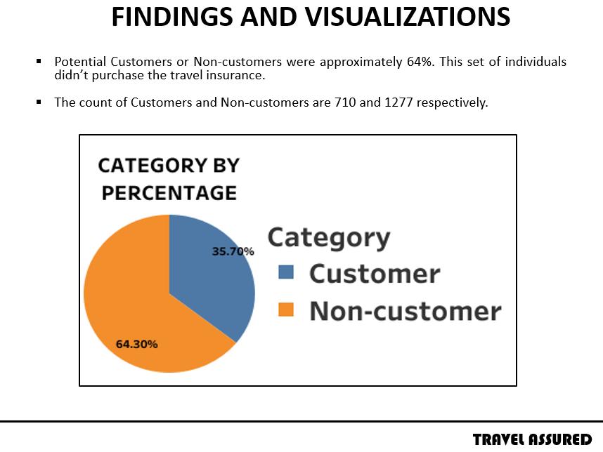
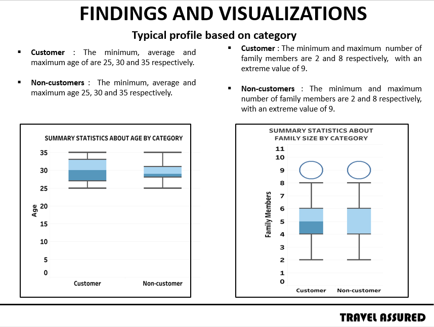
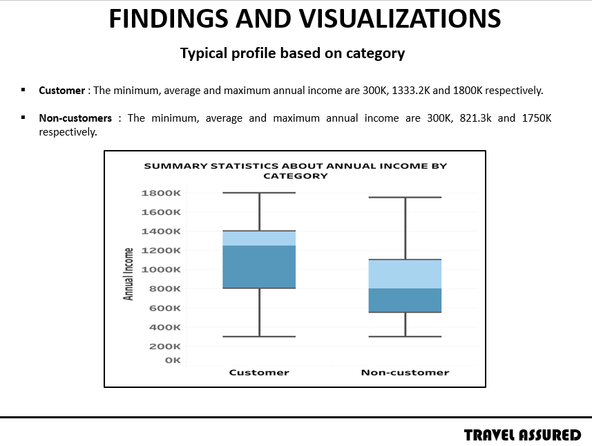
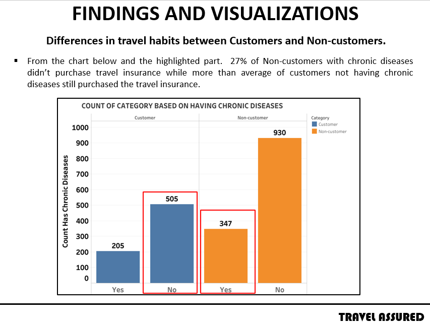
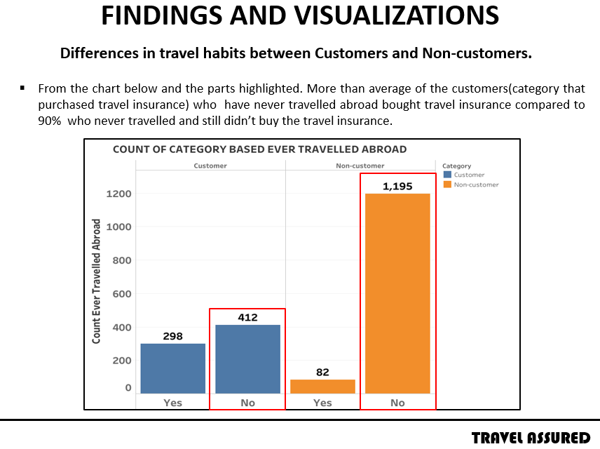

# Travel_Insurance

## INTRODUCTION
During the course of my Internship at Datacamp and prior to being certified as professional Data Analyst. The requirement was that I had to write two timed exams (DA101 & DA201), then proceed to a practical exam(project).
  The two-timed exam focused on:
- Data Management in SQL(PostgreSQL)
- Data Analysis in SQL(PostgreSQL)
- Importing and Cleaning in Python
- Data Manipulation in Python
- Statistical Fundamentals in Python

Below is information about the project.
 
Travel Assured is a travel insurance company. Due to the COVID pandemic, they have had to cut their marketing budget by over 50%. It is more important than ever that they advertise in the right places and to the right people.

Travel Assured has plenty of data on their current customers as well as people who got quotes but never bought insurance.

## ABOUT THE DATASET
 	
The dataset contains the following information: age, employment type, graduate or not, annual income, family members, chronic diseases, frequent flyer, ever travelled abroad, travel insurance. 

## BUSINESS PROBLEM

They want to know to get answers to customer’s questions. They are:
- Are there differences in the travel habits between customers and non-customers?

- What is the typical profile of customers and non-customers?

## FINDINGS & VISUALIZATION

### Typical Customer and Non-customer profile

- Percentage of Customer to Non-Customer

    
- Category by Age

- Category by Annual Income

    
 ### Differences in travel habits between Customers and Non-customers
 
 - Based on Chronic Diseases
 
 
 
 - Based on Ever Travelled Abroad
 
 

## CONCLUSION
  After analysing the dataset, the following were the recommendations made for the company.

### RECOMMENDATION

- Increase in advertisement quality: There should be focus on offering insights and value that give customers reason to care. Taking a look at the case in the analysis of how customers not having chronic diseases still bought travel insurance. But non-customers with chronic diseases still didn’t purchase. The risks associated with not getting their travel insurance should be emphasized. 
 
There should be production of excellence on advertising quality with a focus on improving the company.

- Take advantage of existing customers: Loyal customers should be encouraged to recommend to their network. One of this can be done by sharing the company’s content on social media or referral, this helps build trust and credibility.

- Reaching out to journalist and bloggers whose audience may be interested in what the company is offering. 

